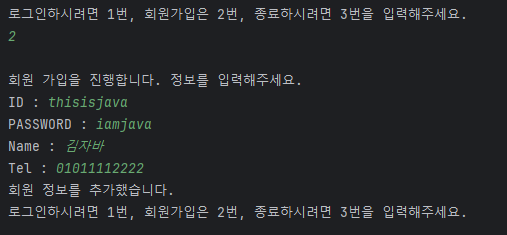

## 🎮 기능 요구 사항

인터넷 쇼핑몰을 기반으로 한 데이터베이스를 이용해 JDBC를 작성한다.
```
✏️ 회원 Entity를 포함한 최소 2개 이상의 Entity 설계
️️✏️ 최소 두 개의 Entity는 Relation을 가지고 있음
✏️ 기능은 기본적인 CRUD 기능을 가지고 있음
✏️ 회원과 관련된 주제는 본인(팀원)과 협의 후 아이디어 선정하여 개발
```

### 공통 기능


🔎 프로그램을 실행하면 메인 화면과 선택지가 출력된다.


🔎 1번을 선택해 로그인 창으로 진입한 후, 관리자 계정으로 로그인 한 모습이다.

- 입력하는 계정에 따라 관리자/유저로 나뉘게 된다.
- 관리자와 유저는 각각 실행할 수 있는 기능이 다르다.



🔎 2번을 선택해 회원가입 창으로 진입한 후, 무사히 회원가입을 마친 모습니다.

- 이미 데이터베이스 내애 존재하는 ID를 입력하게 되면 경고문과 함께 선택지로 돌아가게 된다.
- 회원가입이 끝난 후, 다시 로그인을 해야 프로그램을 이용할 수 있다.

### 관리자 (admin)
- 관리자의 계정은 `id: admin, pwd: admin1234` 로 고정되어있다. (그 외 관리자는 존재하지 않는다.)
- 관리자 계정으로 할 수 있는 일은 다음과 같다.

| 카테고리    | 조회       | 수정       | 삭제    | 추가      |
|---------|----------|----------|-------|---------|
| Member  | 전체 회원 조회 | ❌        | ❌     | ❌       |
| Order   | 전체 주문 조회 | ❌        | ❌     | ❌       |
| Delivery | 전체 배송 조회 | ❌        | ❌     | ❌       |
| Item    | 전체 상품 조회 | 상품 내용 수정 | 상품 삭제 | 새 상품 추가 |

관리자 계정으로는 전반적인 관리가 가능하고, 개인 정보나 주문 정보, 배송 정보 등은 업데이트가 불가능하다.

### 유저 (user)
- Member 테이블 내에 속해 있는 계정들을 말한다.
- 관리자처럼 넓은 범위를 조회할 수는 없지만, 로그인 후 본인과 관련된 정보는 쉽게 조회, 수정, 삭제가 가능하다.
- 유저 계정으로 할 수 있는 일은 다음과 같다.

  | 카테고리    | 조회       | 수정       | 삭제    | 추가      |
  |---------|----------|----------|-------|---------|
  | Member  | 본인 정보 조회 | 본인 정보 수정 | 회원 탈퇴 | ❌       |
  | Order   | 본인 주문 조회 | ❌        | ❌     | 주문하기    |
  | Delivery | 본인 배송 조회 | 주소지 변경   | ❌     | ❌       |
  | Item    | 전체 상품 조회 | ❌ | ❌ | ❌ |

객체 지향 : 인터페이스를 통한 다형성

디자인 패턴 : DB CONNECTOR를 싱글톤 객체로 활용

예외 처리 : 입력 예외를 받기 위해 커스텀 예제 생성

주제 : 로그인 기능이 포함된 인터넷 쇼핑몰

기능 정의
1. 관리자는 전체 회원 목록을 조회할 수 있다.
2. 관리자는 전체 주문 목록을 조회할 수 있다.
3. 관리자는 전체 배송 목록을 조회할 수 있다.
4. 관리자는 전체 상품 목록을 조회할 수 있다.
5. 관리자는 특정 주문 건에 대한 배송을 추가할 수 있다.
6. 관리자는 등록된 상품의 내용을 수정할 수 있다.
7. 관리자는 등록된 상품을 삭제할 수 있다.
8. 관리자는 새로운 상품을 등록할 수 있다.

1. 유저는 본인의 정보를 조회할 수 있다.
2. 유저는 회원 번호를 제외한 본인의 정보를 수정할 수 있다.
3. 유저는 탈퇴를 통해 계정을 삭제할 수 있다.
4. 유저는 상품을 주문할 수 있다.
5. 유저는 본인이 주문한 목록을 조회할 수 있다.
6. 유저는 본인이 주문한 주문 건의 배송을 조회할 수 있다.
7. 유저는 전체 상품 목록을 조회할 수 있다.

- 하나의 기능 실행이 끝나면, 다시 첫 페이지로 돌아와 카테고리를 선택할 수 있어야 한다.
- 첫 화면 실행 시 회원가입 / 로그인 / 프로그램 종료의 선택지가 뜬다.
- 회원가입을 통해 새 유저 정보를 디비에 등록한다.
- 로그인 시, 아이디/패스워드가 디비 내에 존재하는지 확인한 후, 관리자 계정과 유저 계정으로 나누어 접속한다.
- 프로그램 종료 시 디비와의 연결이 끊어진다.