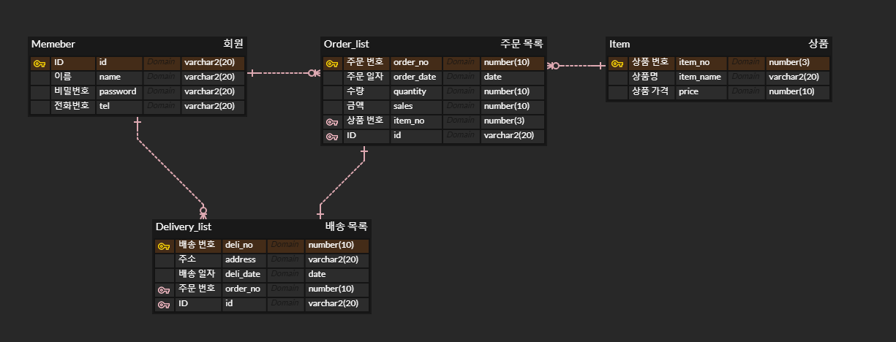
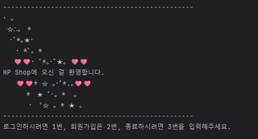
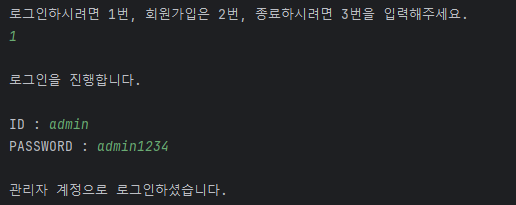
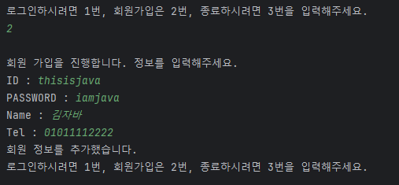
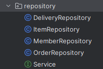

# HB Shopping

## 🚀 개요


자바와 오라클로 간단하게 표현한 인터넷 쇼핑몰 사이트이다.

회원 테이블을 포함해 주문, 상품, 배송까지 총 네 개의 테이블을 가지고 있다.
위 사진에서 PK와 FK를 확인할 수 있다.

## 🎮 기능 요구 사항


```
✏️ 회원 Entity를 포함한 최소 2개 이상의 Entity 설계
️️✏️ 최소 두 개의 Entity는 Relation을 가지고 있음
✏️ 기능은 기본적인 CRUD 기능을 가지고 있음
✏️ 회원과 관련된 주제는 본인(팀원)과 협의 후 아이디어 선정하여 개발
```

### 공통 기능


🔎 프로그램을 실행하면 메인 화면과 선택지가 출력된다.



🔎 1번을 선택해 로그인 창으로 진입한 후, 관리자 계정으로 로그인 한 모습이다.

- 입력하는 계정에 따라 관리자/유저로 나뉘게 된다.
- 관리자와 유저는 각각 실행할 수 있는 기능이 다르다.



🔎 2번을 선택해 회원가입 창으로 진입한 후, 무사히 회원가입을 마친 모습이다.

- 이미 데이터베이스 내애 존재하는 ID를 입력하게 되면 경고문과 함께 선택지로 돌아가게 된다.
- 회원가입이 끝난 후, 다시 로그인을 해야 프로그램을 이용할 수 있다.

- 프로그램이 종료되면 데이터베이스와의 연결도 끊어진다.

### 관리자 (admin)
- 관리자의 계정은 `id: admin, pwd: admin1234` 로 고정되어있다. (그 외 관리자는 존재하지 않는다.)
- 관리자 계정으로 할 수 있는 일은 다음과 같다.

| 카테고리    | 조회       | 수정       | 삭제    | 추가      |
|---------|----------|----------|-------|---------|
| Member  | 전체 회원 조회 | ❌        | ❌     | ❌       |
| Order   | 전체 주문 조회 | ❌        | ❌     | ❌       |
| Delivery | 전체 배송 조회 | ❌        | ❌     | ❌       |
| Item    | 전체 상품 조회 | 상품 내용 수정 | 상품 삭제 | 새 상품 추가 |

관리자 계정으로는 전반적인 관리가 가능하고, 개인 정보나 주문 정보, 배송 정보 등은 업데이트가 불가능하다.

### 유저 (user)
- Member 테이블 내에 속해 있는 계정들을 말한다.
- 관리자처럼 넓은 범위를 조회할 수는 없지만, 로그인 후 본인과 관련된 정보는 쉽게 조회, 수정, 삭제가 가능하다.
- 유저 계정으로 할 수 있는 일은 다음과 같다.

  | 카테고리    | 조회       | 수정       | 삭제    | 추가      |
  |---------|----------|----------|-------|---------|
  | Member  | 본인 정보 조회 | 본인 정보 수정 | 회원 탈퇴 | 회원 가입       |
  | Order   | 본인 주문 조회 | ❌        | ❌     | 주문하기    |
  | Delivery | 본인 배송 조회 | 주소지 변경   | ❌     | ❌       |
  | Item    | 전체 상품 조회 | ❌ | ❌ | ❌ |


## 💻 프로그래밍 요구 사항
### 객체 지향 프로그래밍
인터페이스를 통한 다형성 구현



✏️ create, read, update, delete 총 네 가지의 같은 기능을 수행하는 클래스들이 하나의 인터페이스(Service)를 상속받도록 했다.

``` java
class MemberRepository implements Service<K k, T t>
...
Service service = new MemberRepository();
```
✏️ 제네릭도 활용하였다!

### 디자인 패턴
~1. DBConn 클래스를 싱글톤 객체로 활용~

2. DAO 패턴 사용(하려고 노력)


### 예외 처리
입력 예외를 처리하기 위해 커스텀 예외를 만들어 처리했다.


